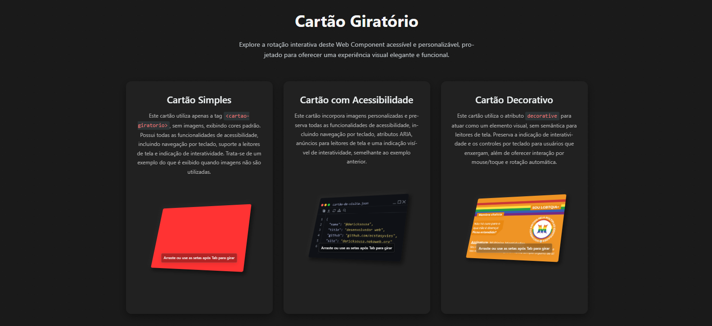

# Cartão Giratório: Web Component

O `CartaoGiratorio` é um Web Component que oferece uma experiência interativa de rotação 3D para exibir a frente e o verso de um cartão. Utiliza Shadow DOM para encapsulamento, suporta interações via mouse, toque e teclado, e segue as diretrizes de acessibilidade WCAG 2.1/2.2. As animações são fluidas com transições CSS 3D, e o componente é altamente personalizável, leve e sem dependências externas.



## Destaques

- Interatividade completa: Suporte a mouse, toque e teclado.
- Personalização avançada: Configuração de cores, dimensões e mensagens de acessibilidade por instância.
- Acessibilidade robusta: Navegação por teclado, suporte a leitores de tela com mensagens personalizáveis e conformidade com WCAG.
- Responsividade: Adaptação a diferentes tamanhos de tela.
- Desempenho otimizado: Sem dependências externas.
- Suporte a temas: Modo claro e escuro via `prefers-color-scheme`.
- Encapsulamento: Isolamento de estilos e comportamento via Shadow DOM.
- Compatibilidade: Fallback progressivo para navegadores sem suporte a Web Components.

## Sumário

- [Instalação](#instalação)
- [Como Usar](#como-usar)
  - [Uso Básico](#uso-básico)
  - [Com Imagens](#com-imagens)
  - [Como Elemento Decorativo](#como-elemento-decorativo)
  - [Interatividade](#interatividade)
- [Acessibilidade](#acessibilidade)
  - [Objetivos da Implementação](#objetivos-da-implementação)
  - [Uso em Contextos Decorativos](#uso-em-contextos-decorativos)
  - [Recursos Implementados](#recursos-implementados)
- [Personalização](#personalização)
  - [Atributos](#atributos)
  - [Variáveis CSS](#variáveis-css)
  - [Personalização por Instância](#personalização-por-instância)
  - [Comportamentos](#comportamentos)
- [Contribuindo](#contribuindo)
- [Atualizações](#atualizações)
- [Licença](#licença)
- [Agradecimentos](#agradecimentos)

## Instalação

1. Baixe o componente:
   ```bash
   git clone https://github.com/ecstasyvies/cartao-giratorio.git
   ```
   Ou faça o download do arquivo `cartao-giratorio.js`.

2. Inclua no projeto:
   ```html
   <script src="caminho/para/cartao-giratorio.js"></script>
   ```

3. Utilize a tag `<cartao-giratorio>` no HTML.

## Como Usar

### Uso Básico

Crie um cartão com cores padrão, sem imagens:

```html
<cartao-giratorio></cartao-giratorio>
```

### Com Imagens

Adicione imagens para a frente e o verso:

```html
<cartao-giratorio
  front-image="caminho/para/frente.jpg"
  back-image="caminho/para/verso.jpg"
></cartao-giratorio>
```

### Como Elemento Decorativo

Use o atributo `decorative` para um cartão sem semântica para leitores de tela, mantendo interatividade visual e por teclado:

```html
<cartao-giratorio
  decorative
  front-image="caminho/para/frente.jpg"
  back-image="caminho/para/verso.jpg"
></cartao-giratorio>
```

### Interatividade

O componente suporta múltiplas formas de interação:

#### Mouse/Toque
- Clicar e arrastar: Gira o cartão em qualquer direção.
- Movimento horizontal: Rotaciona no eixo Y (sem limite).
- Movimento vertical: Rotaciona no eixo X (limitado a ±50°).
- Toque em dispositivos móveis: Suporta gestos de arrastar com prevenção de scroll indesejado.

#### Teclado
- Tab: Foca o cartão.
- ←/→: Rotaciona horizontalmente (±10° por pressionamento).
- ↑/↓: Rotaciona verticalmente (±10° por pressionamento, até ±50°).
- Enter/Espaço: Vira o cartão (180°).

#### Rotação Automática
- Rotaciona automaticamente no eixo Y quando não interagido.
- Pausa durante interações e reinicia após 1,8 segundos de inatividade.
- Respeita `prefers-reduced-motion`, desativando a rotação automática se necessário.

## Acessibilidade

O `CartaoGiratorio` foi projetado com acessibilidade avançada, atendendo a WCAG 2.1/2.2, para servir como referência técnica e suportar usos semânticos.

### Objetivos da Implementação
- Demonstrar conformidade com WCAG 2.1/2.2.
- Criar um componente reutilizável para contextos semânticos.
- Melhorar a experiência para usuários com necessidades específicas.
- Preparar para evoluções com requisitos semânticos.

### Uso em Contextos Decorativos
- O atributo `decorative` aplica `aria-hidden="true"`, removendo semântica para leitores de tela.
- Mantém interatividade visual e por teclado.
- Respeita `prefers-reduced-motion` e navegação por teclado.

### Recursos Implementados
- Navegação por teclado: Controles com indicadores visuais de foco.
- Leitores de tela (modo padrão):
  - `aria-live="polite"` para anúncios de estado (frente/verso), personalizáveis via `front-label` e `back-label`.
  - `aria-hidden` para gerenciamento de visibilidade.
  - `role="group"` e `aria-label` para semântica clara.
- Contraste: Cores com mínimo 4.5:1 conforme WCAG.
- Modo escuro: Ajustes via `prefers-color-scheme`.
- Redução de movimento: Elimina animações automáticas via `prefers-reduced-motion`.
- Dica de interatividade: Texto visual (“Arraste ou use as setas após Tab para girar”) com `aria-hidden="true"`.
- Mensagens personalizáveis: Via `front-label` e `back-label`.
- Fallback: Exibe imagem estática ou cor de fundo com `aria-hidden="true"` em navegadores sem suporte a Web Components.

## Personalização

### Atributos

| Atributo       | Tipo    | Padrão             | Descrição                                                                 |
|----------------|---------|--------------------|---------------------------------------------------------------------------|
| `front-image`  | String  | `null`             | URL da imagem frontal.                                                    |
| `back-image`   | String  | `null`             | URL da imagem do verso.                                                   |
| `decorative`   | Boolean | `false`            | Remove semântica para leitores de tela, mantendo interatividade visual e por teclado. |
| `front-label`  | String  | "Frente do cartão" | Rótulo acessível para a frente, usado em `aria-label` e `aria-live`.     |
| `back-label`   | String  | "Verso do cartão"  | Rótulo acessível para o verso, usado em `aria-label` e `aria-live`.      |

### Variáveis CSS

Personalize via variáveis CSS no escopo do `:host`:

```css
cartao-giratorio {
  /* Dimensões */
  --cartao-largura: 300px;
  --cartao-altura: 200px;
  --cartao-raio-borda: 0.3125rem;

  /* Cores */
  --cartao-cor-frente: #fda233;
  --cartao-cor-verso: #ffc107;

  /* Sombra */
  --cartao-sombra: 6px 6px 12px rgba(0,0,0,0.1);

  /* Animação */
  --cartao-transicao: transform 0.05s ease-out;
}

/* Tema Escuro */
@media (prefers-color-scheme: dark) {
  cartao-giratorio {
    --cartao-cor-frente: #2c3e50;
    --cartao-cor-verso: #34495e;
    --cartao-sombra: 6px 6px 12px rgba(0,0,0,0.3);
  }
}
```

### Personalização por Instância

Cada instância pode ter estilos e mensagens próprias via atributos e CSS.

#### Via Estilo Inline
```html
<cartao-giratorio
  front-image="frente.jpg"
  back-image="verso.jpg"
  front-label="Imagem de um gato"
  back-label="Descrição do gato"
  style="--cartao-cor-frente: #0f1116; --cartao-cor-verso: #555555;"
></cartao-giratorio>
```

#### Via Classe CSS
```html
<cartao-giratorio class="cartao-personalizado" front-label="Imagem de um gato" back-label="Descrição do gato"></cartao-giratorio>
```

```css
.cartao-personalizado {
  --cartao-cor-frente: #0f1116;
  --cartao-cor-verso: #555555;
}
```

#### Múltiplos Cartões
```html
<cartao-giratorio style="--cartao-cor-frente: #fda233; --cartao-cor-verso: #ffc107;" front-label="Cartão padrão" back-label="Verso padrão"></cartao-giratorio>
<cartao-giratorio style="--cartao-cor-frente: #ff0000; --cartao-cor-verso: #0000ff;" front-image="frente.png" back-image="verso.png" front-label="Imagem personalizada" back-label="Descrição personalizada"></cartao-giratorio>
<cartao-giratorio style="--cartao-cor-frente: #0f1116; --cartao-cor-verso: #555555;" decorative front-image="cartaodev.png" back-image="verso.png" front-label="Cartão decorativo" back-label="Verso decorativo"></cartao-giratorio>
```

### Comportamentos

Ajuste constantes no arquivo `cartao-giratorio.js`:

```javascript
{
  SENSIBILIDADE_ROTACAO: 0.25,  // Sensibilidade do arrastar (graus por pixel).
  MAX_ROTACAO_X: 50,            // Limite de rotação vertical (graus).
  TEMPO_REINICIO: 1800,         // Tempo para reiniciar rotação automática (ms).
  ATRITO: 0.60,                 // Fator de desaceleração após arrastar.
  VELOCIDADE_MINIMA: 0.1        // Velocidade mínima para continuar desaceleração.
}
```

Edite o código diretamente para alterações.

## Contribuindo

### Como Contribuir
1. Faça um fork do projeto.
2. Clone o fork.
3. Crie uma branch: `git checkout -b feature/NovaFeature`.
4. Implemente alterações.
5. Commit: `git commit -m 'feat: Adiciona NovaFeature'`.
6. Push: `git push origin feature/NovaFeature`.
7. Abra um Pull Request.

### Diretrizes
- Mantenha o estilo de código (ESLint/Prettier recomendado).
- Documente novas funcionalidades no README.
- Adicione testes para mudanças significativas.
- Certifique-se de acessibilidade e desempenho.

## Atualizações

### Próxima Versão (Planejado)
- Suporte a gestos de pinça para zoom.
- API programática para controle externo.
- Temas CSS adicionais via atributos.
- Suporte a idiomas RTL.
- Animações customizáveis via propriedades CSS.

### Versão Atual (1.1.0)
- Rotação 3D fluida e responsiva.
- Acessibilidade completa com suporte a teclado e leitores de tela, incluindo mensagens personalizáveis.
- Modo decorativo com interatividade visual e por teclado.
- Personalização por instância via variáveis CSS e atributos.
- Suporte a temas claro/escuro.
- Fallback progressivo para navegadores sem suporte a Web Components.
- Eventos restritos ao container para eficiência.
- Documentação detalhada e exemplos.

## Licença

O projeto é licenciado sob a Licença MIT, permitindo uso, modificação e distribuição livre, desde que o aviso de direitos autorais e a licença sejam mantidos. Veja [LICENSE.md](LICENSE.md) para detalhes.

## Agradecimentos

Este projeto utiliza tecnologias da comunidade:

### Web Standards e APIs
- Web Components: Base para o componente.
- Shadow DOM: Encapsulamento.
- Custom Elements: Definição e registro.

### Acessibilidade
- WCAG 2.1/2.2: Diretrizes.
- WAI-ARIA: Suporte a tecnologias assistivas.

### Recursos
- MDN Web Docs: Referência técnica.
- web.dev: Boas práticas.

<p align="center">
  <sub>
    Desenvolvido por <a href="https://github.com/ecstasyvies">ecstasyvies</a><br>
    Parte do portfólio de Web Components
  </sub>
</p>

<p align="center">
  <a href="https://github.com/ecstasyvies/cartao-giratorio/issues">Reportar Bug</a> ·
  <a href="https://github.com/ecstasyvies/cartao-giratorio/pulls">Contribuir</a> ·
  <a href="#cartão-giratório-web-component">Voltar ao Topo</a>
</p>

<p align="center">
  <sub>
    © 2025 ecstasyvies. Todos os direitos reservados.
  </sub>
</p>